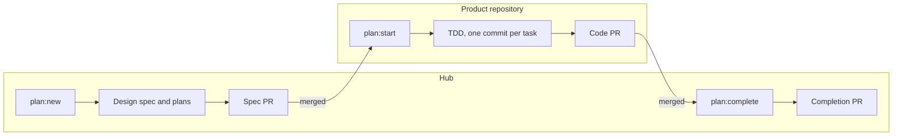

# sdd-lite

A hub for building software with coding agents without losing the plot. Fork it, check out your product repositories inside it as git submodules, and your agents design, plan, build and document every change through it: from a one-line bug fix to an epic spanning several repositories.

The hub holds no product code. It holds what explains the code: what the product does, why it is built the way it is, and how each change was made. Tools check that those documents, the tests and the commits agree.

> Once you fork it, this README describes **your** hub. Replace this paragraph with a line about your product.

New here? Read `docs/ONBOARDING.md`, then `docs/EXAMPLES.md` (four pieces of work on an example product, step by step). The rules are in `docs/WORKFLOW.md`.

## Why it exists

Coding agents are fast but forgetful: they reinvent modules that already exist, skip planning, and leave changes nobody can trace later. People joining a project face the same problem without the speed. The hub answers with three things:

- **A method.** [Superpowers](https://github.com/obra/superpowers) skills take every change through classification, design, planning, test-driven execution and review. The hub uses them unchanged and adds its own rules on top.
- **A memory.** [Graphify](https://github.com/Graphify-Labs/graphify) builds one knowledge graph over every product repository and every document in the hub. Every design starts by asking it what already exists.
- **Checks.** `pnpm check`, git hooks and CI verify that documents, tests and commits agree, so traceability is a fact rather than a promise.

### What it does not do

- Agents follow the rules because skills and `AGENTS.md` tell them to; what really cannot slip is what hooks and CI check. Make the `check` job required, or the rules are advice.
- Planned work costs real agent time and tokens (in the pilots that shaped this hub: about $0.40 for a bug fix, about $11 for a feature across two repositories). Prefer bounded work when it fits.
- `docs/WORKFLOW.md` ("Known limits") lists the rest.

## How a piece of work flows

You talk to your agent in plain words; it picks the command for each step and asks before anything leaves your machine.



That is the **architectural** path. Smaller changes skip most of it: a **trivial** fix is just a commit and a PR, and **bounded** work (a small change to an existing flow) is designed in chat and built in a worktree from `pnpm work:start`. Outcomes too big for one design become **epics**: a PRD, a technical design, and phases. `docs/WORKFLOW.md` has every tier and rule; `docs/EXAMPLES.md` shows each one end to end.

### Prefer bounded work when it fits

The agent classifies every request, and you can always ask for the heavier path. But reach for bounded work whenever a change fits inside one repository and an existing flow:

| | Bounded | Architectural |
|---|---|---|
| Artifacts | Design in chat, one PR | Design spec, a plan per repository, spec PR, code PRs, completion PR |
| Best for | Fixes, small endpoints, flags, copy, refactors inside a module | New modules, changed interfaces, work across repositories, anything a future reader needs a design for |

Split big ideas into bounded steps where you can; keep the architectural path for work whose design deserves to be reviewed and kept.

## Create your hub

Requirements: Node 20+, pnpm, git 2.36+, [Graphify](https://github.com/Graphify-Labs/graphify) 0.9.80+ (`uv tool install graphifyy`), and Superpowers installed in your coding agent (Claude Code or OpenCode).

1. **Fork this repository** (or use it as a template), clone your fork, and set it up:

   ```bash
   git clone git@github.com:<you>/<your-hub>.git && cd <your-hub>
   pnpm hub:setup && pnpm doctor
   ```

2. **Onboard each product repository** by asking your agent, for example "onboard our API: git@github.com:acme/api.git, it's NestJS with CQRS handlers". Its `onboard-repository` skill runs `pnpm repo:add` (which builds the knowledge graph), drafts the repository's architecture map and any contracts, and opens a hub PR for you to review. Presets for `pnpm repo:add`: `nest`, `next`, `sst`, `cqrs`.
3. **Optionally turn on GitHub mode** (`pnpm gh:setup`, see `docs/GITHUB.md`): tracking issues whose numbers are the work IDs, labels, explanatory comments, PRs opened for you, a Project board fed by built-in workflows.
4. **Protect `main`**: require a PR and the `check` job. If any product repository is private, add a read-only `HUB_REPOS_TOKEN` secret so CI can check its code (`docs/GITHUB.md`, "Continuous integration").
5. **Replace the note at the top of this README** with what your hub is for.

## Joining an existing hub

```bash
uv tool install graphifyy             # or: uv tool upgrade graphifyy  (needs 0.9.80 or newer)
git clone --recurse-submodules <hub-url> hub && cd hub
pnpm hub:setup                        # checks tools, checks out repos/, installs hooks
pnpm doctor                           # every line should be ✔
graphify update .                     # builds the knowledge graph (no LLM, seconds)
pnpm check                            # [check] ok
```

Then follow `docs/ONBOARDING.md`.

## Where to find things

| You want to know | Look in |
|---|---|
| How the system fits together | `docs/ARCHITECTURE.md`, then each repository's map in `docs/codebases/` |
| How the repositories talk to each other | `docs/contracts/` |
| What the product does, and how we know it works | `docs/features/`: acceptance criteria, each proven by a test titled with its ID |
| Why something was decided | `docs/adr/`, listed in order under "Evolution" in the architecture document |
| What a piece of work set out to do | `docs/superpowers/specs/` (design) and `docs/superpowers/plans/` (tasks) |
| What is in flight | `pnpm plan:status`, and `docs/epics/` (each epic pairs a PRD with its technical design) |
| How the work is done, step by step | `docs/EXAMPLES.md` |
| The rules | `docs/WORKFLOW.md` |
| GitHub issues, labels, PRs and CI | `docs/GITHUB.md` |
| What to do when something goes wrong | `docs/TROUBLESHOOTING.md` |
| How to write any document | `docs/templates/` |

Living documents (features, contracts, architecture) always describe the code on `main`. Records (specs, plans, ADRs, epics) are dated and never rewritten; only their status changes.

## Definition of done

Planned work is done when all of these are true on the hub's `main`:

- every repository's code PR is merged, and every plan task has a `Task:` footer or is recorded as deferred;
- each plan has a `## Completion` section with its merge commits and the decisions the agent made;
- the design spec has `status: done`, every item of its Documentation impact is applied and ticked, and the behaviour it delivered (or retired) is reflected in `docs/features/`, each criterion proven by a test titled with its ID;
- new ADRs are listed under "Evolution" in `docs/ARCHITECTURE.md`;
- the submodule pointers include the merged code, and `pnpm check` passes.

## The first hour: when something blocks you

The full list is in `docs/TROUBLESHOOTING.md`; these are the common ones.

| Symptom | Fix |
|---|---|
| `pnpm hub:setup` says Graphify is too old | `uv tool upgrade graphifyy`, then rerun |
| A commit is rejected with `[hub]` lines | The line names the rule; examples are under "Branches and commits" in `docs/WORKFLOW.md` |
| `pnpm check` fails | Each line is `file:line [rule] message`; rules are explained under "What `pnpm check` enforces" |
| `pnpm check` says a repository "is checked out at … but the hub points at …" | `git submodule update` |
| Planned work should stop | `pnpm plan:abandon <id> --reason "…"` (if nothing has merged yet; otherwise `pnpm plan:revert <id>` first) |
| `pnpm plan:start` or `pnpm work:start` says the hook self-test failed | `pnpm hub:setup`; for repositories using lefthook, `pnpm install` inside the repository first |
| A graph answer looks out of date | `graphify update .` and ask again |

## Agents

Claude Code reads `CLAUDE.md`, which imports `AGENTS.md`; OpenCode and other agents read `AGENTS.md`. Both find the hub's skills in `.claude/skills/`: `hub-workflow` (which command for which step), `graphify-preflight`, `onboard-repository` and `epic-design`. The agent rules are short; the reasoning behind each is in `docs/WORKFLOW.md`.
