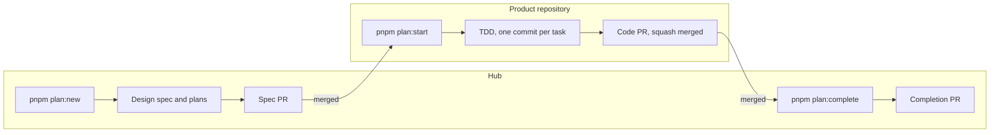

# Hub

The hub is where our product is explained. The code lives in product repositories (NestJS API, Next.js web, SST infrastructure), checked out here as git submodules under `repos/`. Everything that says **what** the product does, **why** it is built the way it is, and **how** a change gets made lives in this repository.

New here? Follow `docs/ONBOARDING.md`. The rules are in `docs/WORKFLOW.md`. Issues, labels and PRs on GitHub are optional and explained in `docs/GITHUB.md`.

## Why it exists

Coding agents are fast but forgetful: they reinvent modules that already exist, skip planning, and leave changes nobody can trace later. People joining a project face the same problem without the speed. The hub answers with three things:

- **A method.** [Superpowers](https://github.com/obra/superpowers) skills take every change through classification, design, planning, test-driven execution and review. We use them unchanged and add a few rules.
- **A memory.** [Graphify](https://github.com/Graphify-Labs/graphify) builds one knowledge graph over every product repository and every document here. Every design starts by asking it what already exists.
- **Checks.** `pnpm check` and git hooks verify that documents, tests and commits agree, so traceability is a fact rather than a promise.

## How a piece of work flows



Small changes skip most of this: a **trivial** fix is just a commit and a PR, and **bounded** work (a small change to an existing flow) is designed in chat and built in a worktree from `pnpm work:start`. The full flow, tiers and rules are in `docs/WORKFLOW.md`.

### Prefer bounded work when it fits

The agent classifies every request, and you can always ask for the heavier path. But reach for bounded work whenever a change fits inside one repository and an existing flow:

| | Bounded | Architectural |
|---|---|---|
| Artifacts | Design in chat, one PR | Design spec, a plan per repository, spec PR, code PRs, completion PR |
| Agent cost in our pilot | about $0.40 for a bug fix | about $11 for a feature across two repositories |
| Best for | Fixes, small endpoints, flags, copy, refactors inside a module | New modules, changed interfaces, work across repositories, anything a future reader needs a design for |

Split big ideas into bounded steps where you can; keep the architectural path for work whose design deserves to be reviewed and kept.

## Where to find things

| You want to know | Look in |
|---|---|
| How the system fits together | `docs/ARCHITECTURE.md`, then the map of each repository in `docs/codebases/` |
| What the product does, and how we know it works | `docs/features/`: acceptance criteria, each proven by a test titled with its ID |
| Why something was decided | `docs/adr/`, listed in order under "Evolution" in the architecture document |
| What a piece of work set out to do | `docs/superpowers/specs/` (design) and `docs/superpowers/plans/` (tasks) |
| What is in flight | `pnpm plan:status` and `docs/epics/` |
| How to write any of these | `docs/templates/` |

Living documents (features, architecture) always describe the code on `main`. Records (specs, plans, ADRs, epics) are dated and never rewritten.

## Quickstart

Requirements: Node 20+, pnpm, git 2.36+, Graphify 0.9.80+, and Superpowers installed in your coding agent.

```bash
uv tool install graphifyy            # or: uv tool upgrade graphifyy  (needs 0.9.80 or newer)
git clone --recurse-submodules <hub-url> hub
cd hub
pnpm hub:setup                       # checks tools, checks out repos/, installs hooks
pnpm doctor                          # every line should be ✔
graphify update .                    # builds the knowledge graph (no LLM, seconds)
pnpm check                           # [check] ok
```

Onboarding a product repository:

```bash
pnpm repo:add api git@github.com:acme/api.git --preset nest
```

It then needs an architecture map (`docs/templates/REPO-ARCHITECTURE.md`) and a row in `docs/ARCHITECTURE.md`; `pnpm check` says exactly what is missing.

## Definition of done

Planned work is done when all of these are true on the hub's `main`:

- every repository's code PR is squash merged, and every plan task has a `Task:` footer or is recorded as deferred;
- each plan has a `## Completion` section with its merge commits and the agent's rulings;
- the design spec has `status: done`, and the behaviour it delivered is in `docs/features/`, each criterion proven by a test titled with its ID;
- architecture documents describe any new structure, and new ADRs are listed under "Evolution";
- the submodule pointers include the merged code, and `pnpm check` passes.

## The first hour: when something blocks you

The full list of pitfalls and ways out is in `docs/TROUBLESHOOTING.md`; these are the common ones.

| Symptom | Fix |
|---|---|
| `pnpm hub:setup` says Graphify is too old | `uv tool upgrade graphifyy`, then rerun |
| A commit is rejected with `[hub]` lines | The line names the rule; examples are under "Branches and commits" in `docs/WORKFLOW.md` |
| `pnpm check` fails | Each line is `file:line [rule] message`; rules are explained under "What `pnpm check` enforces" |
| `pnpm check` says a repository "is checked out at … but the hub points at …" | `git submodule update` |
| Planned work should stop | `pnpm plan:abandon <id> --reason "…"` (if nothing has merged yet; otherwise `pnpm plan:revert <id>` first) |
| `pnpm plan:start` or `pnpm work:start` says the hook self-test failed | `pnpm hub:setup`; for repositories using lefthook, `pnpm install` inside the repository first |
| A graph answer looks out of date | `graphify update .` and ask again |

## Agents

Claude Code reads `CLAUDE.md`, which imports `AGENTS.md`; OpenCode and other agents read `AGENTS.md`. Both find the hub's skills in `.claude/skills/`. The agent rules are short; the reasoning behind each is in `docs/WORKFLOW.md`.
