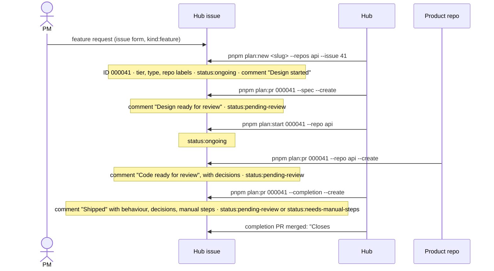

# GitHub mode

GitHub mode makes the hub's work visible where product managers and reviewers already look: issues, pull requests and a Project board. It is optional. Without it every command works the same, IDs are allocated locally, and PR texts are printed for you to paste.

**The rule:** files in the hub are the source of truth; GitHub is a projection of them. Commands update GitHub at fixed moments and only read back what they need (an issue's text, its labels). People discuss in issue comments; decisions that matter move into the spec through a PR.

## What it does



| Moment | Command | On GitHub |
|---|---|---|
| Planned work starts from a request | `pnpm plan:new <slug> --repos <a,b> --issue <n>` | The issue becomes the tracking issue; its number is the work ID; labels; "Design started" comment |
| Planned work starts without a request | `pnpm plan:new <slug> --repos <a,b> [--title "…"] [--epic <slug>]` | A tracking issue is created in the hub repository; its number is the work ID |
| Design is ready | `pnpm plan:pr <id> --spec --create` | Spec PR opened (linked to the issue); "Design ready for review" comment with the goal and behaviour |
| Implementation starts | `pnpm plan:start <id> --repo <name>` | `status:ongoing` |
| Code is ready | `pnpm plan:pr <id> --repo <name> --create` | PR opened in the product repository; "Code ready for review" comment with tasks and decisions; `breaking-change` if a commit header has `!` |
| Work shipped | `pnpm plan:pr <id> --completion --create` | Completion PR with `Closes #<id>`; "Shipped" comment with behaviour, decisions, deferred items and manual steps |
| An epic starts | `pnpm epic:new <slug> [--issue <n>]` | The epic's issue (created or adopted) gets `tier:epic`, `epic:<slug>`, `status:ongoing` and an "Epic design started" comment |
| Epic design ready | `pnpm epic:pr <slug> --create` | Epic PR labelled `epic:<slug>`; "Epic design ready for review" comment with outcome and phases |
| A phase of an epic starts | `pnpm plan:new <slug> --repos <a,b> --epic <epic>` | Its tracking issue becomes a **sub-issue** of the epic's issue; every PR of the phase (hub and product) carries `epic:<epic>` |
| A bug is picked up | `pnpm work:start <repo> fix/<slug> --issue <n>` | The issue and its comments are saved as context for the agent; `tier:bounded`, `status:ongoing`; "Work started" comment |
| The fix is ready | `pnpm work:pr <repo> fix/<slug> --create` | PR with Context, Root cause, What changed, How it was verified and `Fixes <issue>`; "Fix ready for review" comment explaining cause and fix |
| Planned work stops | `pnpm plan:abandon <id> --reason "…"` | Open spec and code PRs closed with the reason; "Abandoned" comment; issue closed as *not planned* |

Every `--create` pushes the branch and opens the PR. Agents must ask before running it, the same as for any push.

Bounded work never creates an issue. When it starts from one (`--issue`), the issue is commented and labelled, and merging the PR closes it.

## Labels

Commands are the only writers of command-owned labels. Changing one by hand is overwritten at the next step; to change where work stands, run the next command.

| Label | Owner | Meaning |
|---|---|---|
| `status:ongoing` | commands | Being designed or implemented |
| `status:pending-review` | commands | A PR is waiting for review |
| `status:needs-manual-steps` | commands | Shipped, but people must still do something: the spec has a `## Manual steps` section or tasks were deferred. The closing comment lists them. |
| `tier:architectural`, `tier:bounded`, `tier:epic` | commands | Which path the work takes (`docs/WORKFLOW.md`, "Work tiers"); `tier:epic` marks an epic's own issue |
| `type:feat`, `type:fix`, `type:refactor`, `type:perf`, `type:chore`, `type:docs` | commands | The Conventional Commit type of the planned branch |
| `repo:<name>` | commands | Product repositories the work touches |
| `epic:<slug>` | commands | Part of `docs/epics/<slug>/`; also set on the phase's PRs, in the hub and in product repositories (created there when first needed) |
| `breaking-change` | commands | A commit header used `!`: behaviour others rely on changes |
| `kind:feature`, `kind:bug` | issue forms | Set when the issue is opened from a form |
| `priority:p0` … `priority:p3` | people | Product priority |
| `blocked` | people | Waiting on something outside the work |
| `needs-info` | people | The request needs more detail before work starts |

A closed issue is done; no label is needed for that.

## Setup

### 1. The `gh` CLI (each person)

```bash
brew install gh          # or see https://cli.github.com
gh auth login            # GitHub.com, SSH or HTTPS, log in with a browser
gh auth status           # must say "Logged in"
```

The default scopes (`repo`, `read:org`) are enough for issues, labels and PRs. The tools never touch Projects through the API, so the `project` scope is not needed.

SSH host aliases such as `git@github.com-personal:acme/api.git` are fine: the hub reads `owner/name` from the URL and `gh` talks to github.com.

### 2. Turn GitHub mode on (once per hub)

```bash
pnpm gh:setup                     # reads the hub's repository from its origin remote
pnpm gh:setup --hub-repo acme/hub # or name it
```

It checks `gh`, records `"github": { "enabled": true, "hubRepo": "acme/hub" }` and each product repository's `owner/name` in `hub.config.json`, and creates every label above in the hub repository. Rerun it after adding repositories or epics; it only creates or updates labels. `pnpm repo:add` in GitHub mode creates the new `repo:<name>` label itself.

Commit the `hub.config.json` change (`chore: enable github mode`). From then on every clone uses GitHub mode, and every person needs `gh` logged in. A hub uses one ID scheme for its whole life: switch on GitHub mode before the first planned work, or the local IDs and issue numbers may collide.

### 3. Repository settings (once per repository, in GitHub's settings)

| Setting | Where | Value | Why |
|---|---|---|---|
| Allow squash merging | General → Pull Requests | only squash | One commit per PR on `main`; easy to find and revert |
| Default commit message | General → Pull Requests → squash | "Pull request title and description" | The title from `plan:pr` becomes the commit header; its body keeps `Plan:`, `Task:` and `Ruling:` |
| Automatically delete head branches | General → Pull Requests | on | Branches end with their PR; the squash commit holds the work |
| Branch protection | Branches → `main` | require a PR and a review | The hub's tools never push to `main` |

### 4. The Project board (once)

Create a Project (board or table) for the hub repository, then open its **Workflows**:

- **Auto-add items**: repository = the hub, filter `is:issue label:"status:ongoing"`. Epics and their phases arrive the same way; GitHub shows each phase as a sub-issue of its epic. Every piece of work gets `status:ongoing` when it starts (planned or bounded), so it appears on the board then, and stays after its status label moves on. GitHub Free allows one auto-add workflow per project; paid plans allow more. Items that existed before you enable it are not added; drag those in by hand.
- **Issue or pull request closed** sets status Done. It is enabled by default when the project is created; keep it.

Then add a board column or table group per `status:*` label, and filters by `repo:*`, `epic:*`, `priority:*` or `breaking-change` as your team likes. The Project reads labels; nothing in the hub writes to it.

## Pull request texts

The commands write every PR the hub opens, so they read the same everywhere:

- **Code PRs** (`plan:pr --repo`): Context (goal, design, tracking issue), What changed (tasks and files), Acceptance criteria, Decisions made during implementation, Review focus (from the plan), How it was verified, then the `Plan:`, `Task:` and `Ruling:` footers.
- **Fix PRs** (`work:pr`): Context (the issue it came from), Root cause or Rationale, What changed, How it was verified, Risk, then `Fixes` and `Refs:`. The sections come from labelled paragraphs in the commit body (`Cause:`, `Rationale:`, `Fix:`, `Verification:`, `Risk:`), described in `docs/WORKFLOW.md`.
- **Hub PRs written by hand** use `.github/pull_request_template.md`.

## Continuous integration

`.github/workflows/check.yml` runs `pnpm check` and `pnpm test` on hub PRs. It needs no setup for public product repositories. For private ones, create a fine-grained token with read-only *Contents* access to them and store it as the hub repository's Actions secret `HUB_REPOS_TOKEN`. The workflow rewrites SSH URLs (including host aliases such as `github.com-personal`) to HTTPS before checking out submodules. Then require the `check` job in the hub's branch protection.

## Issue forms

`.github/ISSUE_TEMPLATE/` holds two forms written for non-engineers:

- **Feature request**: the problem, who has it, how we will know it worked, constraints. Engineers turn it into planned work with `pnpm plan:new … --issue <n>`.
- **Bug report**: what happened, what should have happened, how to see it, impact. Engineers pick it up with `pnpm work:start … --issue <n>` (or plan it if it turns out architectural).

## What the tools never do on GitHub

- Merge a pull request or push to `main`.
- Close an issue or PR on its own: closing happens through `Closes`/`Fixes` when a person merges, or when a person runs `pnpm plan:abandon`.
- Edit an issue's description after creating it, except the tracking issue the hub itself created.
- Change human-owned labels or write to a Project.
- Run without `gh` being logged in: in GitHub mode a missing login stops the command before anything changes.

## Troubleshooting

| Symptom | Fix |
|---|---|
| "`gh` is not logged in" | `gh auth login` |
| "could not add label: '…' not found" | `pnpm gh:setup` (labels are created or updated) |
| "cannot tell the GitHub repository of …" | Set `"github": "owner/name"` for that repository in `hub.config.json` |
| A PR was opened but the issue got no comment | The command stopped on an error after opening the PR | Rerun the same `--create`: it reuses the open PR and posts only the comments that are missing (each carries a hidden marker) |
| Commands act as the wrong account | `gh` can be logged into several accounts | `pnpm doctor` shows the active one; `gh auth switch --user <account>` |

More situations and their fixes: `docs/TROUBLESHOOTING.md`.
