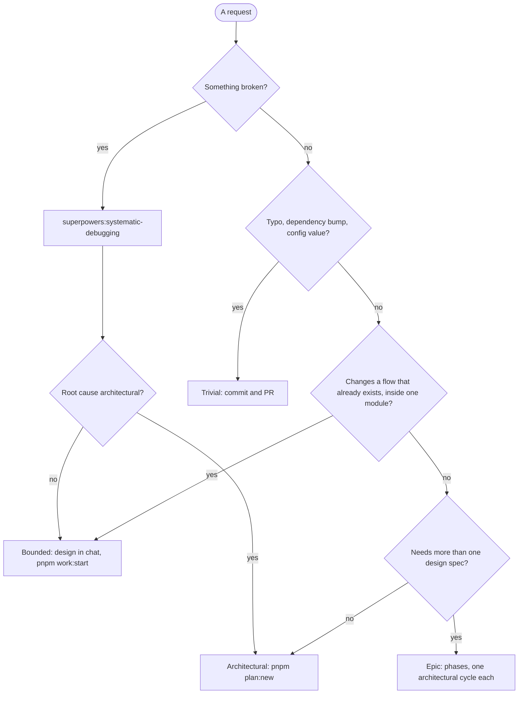
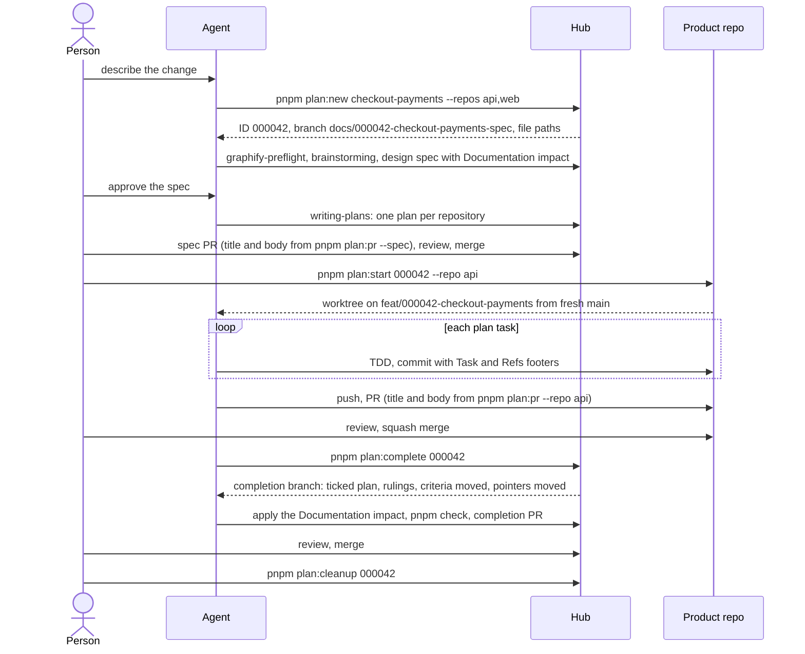
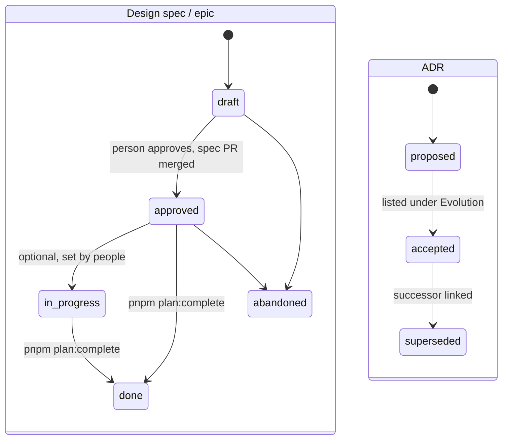
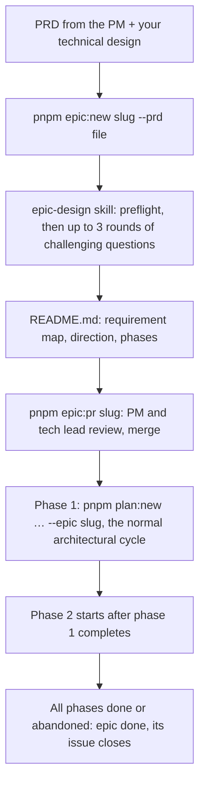

# How we work

This is the contract between people, coding agents and the tools in this hub. Everything the tools enforce is written down here; if a rule is not here, nothing enforces it.

The method combines two things:

- **[Superpowers](https://github.com/obra/superpowers)** supplies the discipline: brainstorm before building, classify the work, write specs and plans, execute with TDD and review. We use its skills unchanged.
- **[Graphify](https://github.com/Graphify-Labs/graphify)** supplies memory: one knowledge graph over every product repository and every document in this hub, so design starts from what already exists.

This file adds what neither provides: where documents live, how work is identified across repositories, and checks that keep documents and code honest with each other. `docs/EXAMPLES.md` follows four pieces of work through these rules, step by step.

## Principles

1. **Start from what exists.** Design begins with a graph preflight, never from a blank page.
2. **Scale the ceremony to the risk.** A typo fix needs a commit; a new subsystem needs a spec, a plan and two reviews.
3. **Documents either describe now or record then.** Living documents must always match the code; records are dated and never rewritten.
4. **Rules that matter are enforced by tools.** Prompts guide agents; hooks and `pnpm check` decide.
5. **Humans first.** Every document is written to be read by a new engineer without an agent in the room.

## Where things live

| Location | What | Kind |
|---|---|---|
| `repos/` | Product repositories, one git submodule each | code |
| `docs/ARCHITECTURE.md` | The system map: hub structure, product repositories, how they talk, evolution | living |
| `docs/codebases/` | Per repository: `ARCHITECTURE.md` (the map) and `architecture/<area>.md` (areas that outgrew the map) | living |
| `docs/features/` | What the product does, by capability, with acceptance criteria | living |
| `docs/contracts/` | Interfaces one repository offers and others rely on (APIs, events), citing the code on both sides | living |
| `docs/ONBOARDING.md`, `docs/WORKFLOW.md`, `docs/EXAMPLES.md`, `README.md` | How to join and how to work | living |
| `docs/epics/<slug>/` | An outcome delivered in phases: `prd.md` (the product requirements) and `README.md` (the technical design and phases) | record |
| `docs/superpowers/specs/` | Design specs, one per piece of planned work, named `<id>-<slug>-design.md` | record |
| `docs/superpowers/plans/` | Implementation plans, one per repository, named `<id>-<slug>--<repo>.md` | record |
| `docs/adr/` | Architecture decision records, `NNNN-<slug>.md` | record |
| `docs/spikes/` | Spike notes worth keeping, `YYYY-MM-DD-<slug>.md` | record |
| `docs/templates/` | Starting points for every document above | reference |
| `tools/` | The checker, plan commands, hooks and their tests | code |

Documents anywhere else under `docs/` fail `pnpm check`. That is deliberate: a new kind of document is a decision, and decisions get an ADR.

**Living documents** are edited whenever the code they describe changes, and `pnpm check` verifies them against the code. **Records** are written once, approved, and afterwards only their `status` changes (and, for a design spec, the ticks in its Documentation impact checklist). They cannot decay because they never claim to describe the present.

## Who does what

You talk to the agent in plain words ("start planned work on checkout payments", "onboard the api repository", "here is the PRD for faster checkout"). It picks the command; the `hub-workflow` skill maps every stage to one.

| Step | Who |
|---|---|
| Classify the request, run the graph preflight, run `plan:new` / `epic:new` / `work:start`, write specs, plans and epic designs, run `plan:pr`, `plan:complete`, apply the Documentation impact | Agent, asking before anything leaves your machine (pushes, PRs, GitHub writes) |
| Answer design questions, approve specs and epics, approve every push and PR, merge | You |
| `plan:start`, then open a new agent session in the worktree it prints | You: an agent can run `plan:start`, but it cannot move its own session into the worktree |
| Review an onboarding PR (architecture map drafted by the agent) | You, for what code cannot show: intent, owners, deployment |

### Who sets each status

| Document | Status | Set by |
|---|---|---|
| Design spec | `draft` | The agent, when it writes the spec |
| | `approved` | The agent, when you approve the written spec (`plan:start` refuses anything else) |
| | `done` | `pnpm plan:complete` |
| | `abandoned` | `pnpm plan:abandon` |
| Epic | `draft` → `approved` | The agent writes it as draft; set to approved when you approve it, before `epic:pr` |
| | `in-progress`, `done`, `abandoned` | A person, in a hub PR (`epic:pr` writes the closing PR text once it is `done`) |
| ADR | `proposed` → `accepted` → `superseded` | The author in the PR that adds it; accepting it also adds it to "Evolution" |
| Spike note | `draft` → `done` | Its author |

## Work tiers

Superpowers' brainstorming classifies every request out loud. We add one tier below it and one above it.

| Tier | Example | What you produce | IDs |
|---|---|---|---|
| **Trivial** | Typo, dependency bump, config value | A Conventional Commit and a PR in the product repo | none |
| **Bounded** | New flag, small endpoint, one-file fix in an existing flow | Design agreed in chat; PR in the product repo; update living docs if behaviour or structure changed | none |
| **Architectural** | New module, changed interface, anything spanning repositories | Design spec, plans, ADRs when warranted, spec PR, code PRs, completion PR | one six-digit ID |
| **Epic** | An outcome needing several architectural cycles | Epic document plus one architectural cycle per phase | one ID per phase |



When in doubt, take the heavier tier. Hidden complexity found mid-task moves work up a tier, never down.

That rule protects quality; it is not a preference for ceremony. When a change genuinely fits one repository and an existing flow, **bounded work is the recommended path**: one PR and a fraction of the agent cost (in our pilot, about $0.40 for a bug fix against about $11 for a feature across two repositories). People can split a large idea into bounded steps; the architectural path is for work whose design must be reviewed and kept. Bugs start with `superpowers:systematic-debugging` and are Bounded unless the root cause turns out to be architectural.

### Bounded work

1. Graph preflight (see below), scaled down: one or two queries.
2. Brainstorming presents a short design in chat; nothing starts before a person says yes.
3. `pnpm work:start api fix/login-redirect` creates `.worktrees/api--login-redirect` on that branch from the freshly fetched default branch and proves the hooks run. Implement there with TDD. Never work directly in `repos/<name>`: those checkouts stay at the hub's submodule pointers so the graph and `pnpm check` see the code the documents describe.
4. Commit with a body made of labelled paragraphs, which `work:pr` turns into the PR's sections:

   ```
   fix(routes): reject malformed vote buckets

   Cause: parseInt read leading digits, so "2abc" became 2.
   Fix: accept the bucket only if it is all digits.
   Verification: route tests for "2abc" and "3.7" expect a 400.
   Risk: none; valid buckets behave as before.

   Refs: VOTE-SCALE-2
   ```

   Use `Cause:` for a bug and `Rationale:` for any other change; `Context:` and `Risk:` are optional.
5. `pnpm work:pr api fix/login-redirect` prints the PR (Context, Root cause or Rationale, What changed, How it was verified, Risk, footers); with `--create` in GitHub mode it pushes, opens it, and explains the fix on the issue it came from. Squash merge it.
6. If behaviour changed, update the acceptance criteria in `docs/features/` (hub PR; add a new criterion before committing the code, because the commit hook only accepts `Refs:` IDs the hub defines). If structure changed, update the repository's architecture docs. Once the code PR is merged, that hub PR also moves the repository's submodule pointer to it (`git -C repos/api fetch && git -C repos/api checkout --detach origin/main && git add repos/api`), so `pnpm check` sees the code the documents now describe. Bounded work that changes no document leaves the pointer alone; the next completion moves it.
7. `pnpm work:cleanup api fix/login-redirect` removes the worktree and local branch.

### Architectural work



1. **Allocate.** `pnpm plan:new checkout-payments --repos api,web` fetches the hub, allocates the next ID, creates the branch `docs/000042-checkout-payments-spec` and prints the exact spec and plan paths.
2. **Design.** Run the graph preflight, then `superpowers:brainstorming`. Give it the printed spec path. The spec starts from `docs/templates/DESIGN-SPEC.md` additions: `## Context` from the preflight, `## Acceptance criteria` in EARS, `## Documentation impact` (every living document the work will change: architecture maps, contracts, feature documents), and links to ADRs. A person approves it; set `status: approved`.
3. **Plan.** `superpowers:writing-plans` writes one plan per repository at the printed paths, with the additions from `docs/templates/PLAN-ADDENDUM.md`.
4. **Spec PR.** `pnpm check`, commit `docs(spec): 000042 checkout-payments`, push, and open the PR with the title and body from `pnpm plan:pr 000042 --spec`. The body leads with the goal and the behaviour in plain language, so non-engineers can review it. Merge; from here `main` shows the work as approved.
5. **Execute.** `pnpm plan:start 000042 --repo api` fetches the product repo, creates `.worktrees/api--000042-checkout-payments` on `feat/000042-checkout-payments` from the fresh default branch, proves the hooks work, refreshes the graph and prints the command to start the agent there. The agent runs `superpowers:subagent-driven-development` or `superpowers:executing-plans`.
6. **Code PR.** The agent finishes with `superpowers:finishing-a-development-branch`, choosing **Push and create a Pull Request**, with the title and body from `pnpm plan:pr 000042 --repo api`. The body ends with the `Plan:` and `Task:` footers. Review, then squash merge.
7. **Complete.** When every repository's code PR is merged, `pnpm plan:complete 000042` creates `docs/000042-checkout-payments-completion`, ticks the plan checkboxes from the `Task:` footers, copies the agent's rulings from the `Ruling:` footers (and from the Superpowers ledger if a run left one), records the merge commits, moves the submodule pointers, moves the spec's acceptance criteria into the feature document named in its `## Links`, and sets the spec to `done`.
8. **Completion PR.** The agent applies the spec's Documentation impact (it is printed by `plan:complete`) to the living documents and ticks each item; `pnpm check` refuses a done spec with an unticked item, and also names any structural file no architecture document covers. Commit `docs(completion): 000042 checkout-payments`, open the PR with `pnpm plan:pr 000042 --completion` (it lists the documentation updated), review, merge.
9. **Clean up.** `pnpm plan:cleanup 000042` removes the worktrees and local branches once the completion PR is on `main`.

Phase N+1 of an epic starts at step 1 only after phase N's completion PR is merged.

### Abandoning

When planned work should stop before any of its code merges, `pnpm plan:abandon 000042 --reason "…"`:

- refuses if any repository already merged the work (revert that first with `pnpm plan:revert`);
- removes the clean worktrees and local branches;
- if the spec reached `main`, opens `docs/000042-<slug>-abandon` with the spec set to `abandoned`, for a short hub PR whose commit message carries the reason;
- in GitHub mode, closes the open spec and code PRs with the reason, comments it on the tracking issue and closes the issue as *not planned*.

### Reverting

If merged work fails QA, `pnpm plan:revert 000042` prints, without running anything, the commands that revert each repository's squash commit on a `revert/<slug>` branch and the hub's completion commit. Review them, run them step by step, and merge the resulting PRs like any bounded change.

## Graph preflight

Before any design, run the `graphify-preflight` skill (`.claude/skills/graphify-preflight/SKILL.md`). It refreshes the graph with `graphify update .`, queries it, opens the files it points to, and produces a `## Context` block: existing modules to reuse, constraining ADRs and features, high-traffic modules the change touches, and open risks. Brainstorming's "Explore project context" step **is** this preflight.

Only edges tagged `EXTRACTED` count as facts. `INFERRED` and `AMBIGUOUS` edges are leads to verify by reading the code.

## Specifications

### Feature documents (living)

One file per user-facing capability in `docs/features/`. Each opens with one user-story line for the why, then lists acceptance criteria. Every criterion has a stable ID in bold and is written in EARS:

| Pattern | Shape |
|---|---|
| Ubiquitous | The system shall … |
| Event-driven | When <trigger>, the system shall … |
| State-driven | While <state>, the system shall … |
| Unwanted behaviour | If <condition>, then the system shall … |
| Optional feature | Where <feature is enabled>, the system shall … |

Multi-step user-interface flows may use Given/When/Then for a single criterion instead; never both forms for the same criterion.

IDs look like `BILL-ISSUE-1`: uppercase segments ending in a number. They never start with `ADR-` or `RFC-`. An ID, once published, is never reused for different behaviour.

### Design specs (records)

The Superpowers design document, plus our additions: frontmatter (`type: design`, `status`), `## Context`, `## Acceptance criteria` for new or changed behaviour, `## Documentation impact`, optional `## Manual steps`, and `## Links`. Acceptance criteria are defined here first; the completion PR copies them into `docs/features/`, because only then do they describe `main`.

**Documentation impact** plans the living-document changes with the design, so they are reviewed in the spec PR instead of remembered at the end. Each item is a checkbox naming the document and what changes (`- [ ] \`docs/codebases/api/ARCHITECTURE.md\`: add the saved-card path`), or one line `- None: <why>`. The items are applied in the completion PR, when the documents describe `main`, and ticked there.

Statuses: `draft`, `approved`, `in-progress`, `done`, `abandoned`. ADRs move from `proposed` to `accepted` to `superseded`.



The design spec's `## Links` names the feature document its criteria belong to: `- Feature: [Checkout payments](../../features/checkout-payments.md)` for an existing document, or `` - Feature: `docs/features/checkout-payments.md` `` for one that `pnpm plan:complete` will create. A spec touching several capabilities groups its criteria under `###` headings that each name their feature the same way.

### ADRs (records)

Write an ADR only when at least one of these holds:

- the decision is expensive to reverse (data schema, public API, protocol, persistence model);
- it crosses module or repository boundaries;
- it adds a runtime dependency or infrastructure;
- real alternatives were rejected and a future reader will ask "why not the other one?".

Everything else belongs in the design spec. ADRs are never a unit of work and never a decomposition of an epic. Numbers are global across all repositories, four digits (Graphify only recognises up to five digits in citations), and the first heading is `# ADR-NNNN: <title>`. A superseded ADR keeps its file, changes `status` to `superseded`, and links its successor. Statuses: `proposed`, `accepted`, `superseded`.

### Epics

An epic is an outcome too big for one design spec: usually a PM's PRD plus an engineer's technical design. It lives in `docs/epics/<slug>/`:

- `prd.md`: the product requirements in the PM's words, each marked with a stable ID (`**REQ-1**`, `**REQ-2**`, …);
- `README.md`: the technical design that pairs with it: Outcome, **Requirement map** (every `REQ-n` to a phase, or out of scope with the reason), Architecture direction, Contracts, Decisions, Edge cases settled while designing, and **Phases**.



1. **Start.** Give the agent the PRD and your design; it runs `pnpm epic:new <slug> --prd <file> [--issue <n>]`, which opens the branch `docs/epic-<slug>`, stores the PRD and, in GitHub mode, creates or adopts the epic's issue.
2. **Challenge.** The `epic-design` skill grounds itself in the graph, numbers the requirements, then asks at most three rounds of up to five questions, each with its recommended answer: requirements first, then edge cases and failure modes, then phase boundaries, contracts and decisions. Nothing is written until you approve the summary.
3. **Write and review.** It writes `README.md`; `pnpm check` verifies every requirement is mapped; `pnpm epic:pr <slug>` gives the PR text (in GitHub mode `--create` opens it and comments on the epic's issue). PM and tech lead review the direction and phases.
4. **Phases.** Each phase starts only when the previous one is complete, as planned work (`pnpm plan:new <slug> --repos … --epic <epic>`) or bounded work. Its spec links the epic in `## Links` (`- Epic: [<epic>](../../epics/<epic>/README.md)`), its acceptance criteria name the requirements they fulfil (`(REQ-2)`), and the epic's Phases table gets its spec link. In GitHub mode its tracking issue becomes a sub-issue of the epic's issue, and its PRs carry the `epic:<slug>` label.
5. **Done.** When every phase links a spec that is done or abandoned, set the epic to `done` in a hub PR; `pnpm epic:pr <slug>` then writes a closing PR text with `Closes #<epic issue>`.

Requirements trace end to end: `REQ-2` → the phase's acceptance criteria → tests titled with those IDs → the code.

### Spikes

Spikes follow Superpowers (answer first, throwaway code); write a spike note only when the findings matter and no ADR records them.

## Plans

Plans come from `superpowers:writing-plans` unchanged, with the additions in `docs/templates/PLAN-ADDENDUM.md`:

- header lines `**Repo:**` and `**Branch:**`;
- an `## Execution rules` section the executing agent must follow;
- every commit step written as `git commit -m "<type>(<scope>): <summary>" --trailer "Task: <n>" --trailer "Refs: <ids>"`, because the implementer subagent sees only its own task;
- every test that proves an acceptance criterion has a title starting with the ID, e.g. `it('CHECKOUT-PAY-1: charges the saved card', …)`.

Plans have no frontmatter. Their checkboxes stay unticked until `pnpm plan:complete` ticks them from git history; `pnpm check` rejects hand-ticked boxes. Progress during execution is shown by `pnpm plan:status`.

## Branches and commits

Every repository uses [Conventional Commits](https://www.conventionalcommits.org/): `<type>(<scope>)!: <summary>` with type one of `feat`, `fix`, `docs`, `style`, `refactor`, `perf`, `test`, `build`, `ci`, `chore`, `revert`. In product repositories the ID never goes in the first line; it lives in footers. Hub commits put it in the summary (`docs(spec): 000042 checkout-payments`), because there the ID is the subject.

| What | Pattern | Example |
|---|---|---|
| Hub spec branch | `docs/<id>-<slug>-spec` | `docs/000042-checkout-payments-spec` |
| Hub completion branch | `docs/<id>-<slug>-completion` | `docs/000042-checkout-payments-completion` |
| Planned code branch | `<type>/<id>-<slug>` | `feat/000042-checkout-payments` |
| Bounded code branch | `<type>/<slug>` | `fix/login-redirect` |
| Other hub changes (onboarding, process, templates) | `<type>/<slug>` | `chore/onboard-nefertum` |

A planned task commit:

```
feat(payments): charge saved card on checkout

Plan: 000042
Task: 3
Refs: CHECKOUT-PAY-2, ADR-0012
```

- `Plan:` is added automatically from the branch name.
- `Task:` names the plan task the commit completes (`Task: 3, 4` if one commit finishes two).
- `Refs:` lists ADR numbers and acceptance-criteria IDs; every one must exist.
- `Ruling:` records a decision the executing agent made where the plan was wrong or silent: `Ruling: <decision> — <why> — <cost if wrong>`. Superpowers keeps rulings in a ledger it deletes when the run finishes, so the footer is the durable copy.

Code PRs are squash merged. Configure each product repository on GitHub with squash merging and the default squash message "Pull request title and description": the title generated by `pnpm plan:pr` becomes the commit header, and its body, which ends with the `Plan:` and `Task:` footers, becomes the commit body. One squash commit per repository per plan makes a failed feature easy to find and revert:

```
git log --grep '^Plan: 000042' origin/main
```

IDs are six digits, allocated only by `pnpm plan:new`, shared by the design spec and every plan of that piece of work. If two unmerged spec PRs pick the same ID, `pnpm check` fails on the second after it rebases, and that one runs `pnpm plan:new` again. This is cheap because nothing outside the hub uses an ID until its spec PR is merged.

## Tracing code back to its reasons

From most to least durable:

1. **Tests name acceptance criteria.** A test title starting with `CHECKOUT-PAY-2:` ties behaviour to its specification; `pnpm check` verifies the link in both directions.
2. **Commit footers.** `git blame` gives the commit; its `Plan:` and `Refs:` footers give the plan, ADRs and criteria.
3. **Rationale comments**, only where the code alone cannot explain a choice:

   ```ts
   // WHY: rotate on every refresh so a replayed token is detectable (ADR-0007)
   ```

   Graphify turns `// WHY:`, `// NOTE:` and `ADR-NNNN` in TypeScript and JavaScript comments into graph nodes linked to the file. `SPEC:` is not recognised by Graphify, so we do not use it.

Hub documents point at code with backticked hub-relative paths, optionally with a symbol: `` `repos/api/src/billing/billing.service.ts::BillingService` ``. Graphify turns these into `EXTRACTED` edges, so `graphify explain "BillingService"` lists every document that cites it.

## Onboarding a repository

Ask the agent to "onboard <name>". Its `onboard-repository` skill runs `pnpm repo:add` (which installs hooks and builds the knowledge graph with the new code in it), drafts `docs/codebases/<name>/ARCHITECTURE.md` from the graph and the code, writes or extends contracts with the other repositories, gets `pnpm check` green and proposes a hub PR on `chore/onboard-<name>`. A person reviews it: intent, owners, deployment and plans are often not in the code, and the agent lists what it could not tell.

## Contracts

`docs/contracts/<name>.md` describes an interface one repository offers and others rely on: a GraphQL or REST API, events, a shared package. Frontmatter names `provider: <repo>` and `consumers: [<repo>, …]`; the body lists operations, types, errors and compatibility rules, citing the code on both sides with backticked paths. `pnpm check` requires at least one cited path in each named repository and a link from "How the repositories interact" in `docs/ARCHITECTURE.md`, so Graphify connects provider and consumer code through the contract.

Contracts are living documents: work that changes one lists it in its spec's Documentation impact. A breaking change (removing or retyping anything a consumer uses) needs an ADR and a release plan for both sides.

## Architecture documents

- `docs/ARCHITECTURE.md` is the system map. Its `## Evolution` section links every accepted ADR in order; together with git history it is the record of how the architecture changed.
- `docs/codebases/<repo>/ARCHITECTURE.md` is one repository's map, at most about 200 lines: purpose, what it deploys, a module index, cross-cutting concerns, invariants.
- `docs/codebases/<repo>/architecture/<area>.md` exists only when an area outgrows the map (more than about 80 lines of its own, its own invariants, or three or more ADRs). Areas follow code boundaries: a NestJS module, a Next.js route group, the SST infrastructure. Each declares the code it covers in `paths:`.

`hub.config.json` lists, per repository, the structural files that must be documented (`mustDocument`). The presets are NestJS modules (`**/*.module.ts`), Next.js top-level route groups (`**/app/*/layout.tsx`, `**/app/*/page.tsx`), SST (`**/sst.config.ts`, `**/infra/**/*.ts`) and CQRS handlers (`**/*.handler.ts`, for repositories whose use cases are command and query handlers). Edit `mustDocument` in `hub.config.json` to add more. Each such file must be mentioned by backticked path in an architecture doc or covered by an area's `paths`.

Diagrams are welcome and written in Mermaid. Graphify skips fenced code blocks, so every box in a diagram also appears as a backticked path in the prose.

## The knowledge graph

- The graph is built at the hub root and covers the hub's documents and every checked-out repository. It lives in `graphify-out/`, which is not committed.
- `pnpm hub:setup` sets `submodule.recurse`, so `git pull` and `git switch` in the hub move the submodule checkouts with the pointers; `pnpm check` fails if a checkout and its pointer disagree.
- `graphify update .` rebuilds the code and Markdown structure without an LLM in seconds. The preflight, `pnpm plan:start` and `pnpm plan:complete` run it, so it is fresh at every decision point.
- The LLM pass over documents (`/graphify . --update` inside an agent) is optional and costs tokens. Run it when `graphify-out/needs_update` exists before architectural design, after a person agrees.
- Graphify 0.9.80 or newer is required; older versions do not link hub documents to code.

## What `pnpm check` enforces

| Rule | Checks |
|---|---|
| `location` | Documents live only where "Where things live" says, with the right filename pattern |
| `frontmatter` | Correct `type`, allowed `status`, no extra fields, area `paths` inside their repository |
| `adr` | An ADR's first heading is `# ADR-NNNN: …` matching its filename |
| `links` | Every relative Markdown link resolves |
| `code-paths` | In living documents, every backticked file path (with an extension) or directory (ending in `/`) under `repos/`, `docs/` or `tools/` exists, and every `::Symbol` appears in that file |
| `placeholders` | No `TBD`, `TODO`, `FIXME`, `insert here` or `lorem ipsum` outside code |
| `adr-refs` | Every `ADR-NNNN` in documents and product code has a file |
| `ids` | One design spec per ID; plans share their spec's ID and slug |
| `plans` | `**Spec:**`, `**Repo:**`, `**Branch:**` headers; tasks numbered 1..N; every task has steps |
| `progress` | Checkboxes are unticked until completion, then ticked except deferred tasks |
| `completion` | Completed plans record rulings and merge commits, and the submodule pointer includes them |
| `repos` | Every configured repository is a checked-out submodule, checked out at exactly the pointer the hub records |
| `ac` | Each criterion is defined once in `docs/features/`, has a test titled with its ID, and every ID a test cites is defined |
| `architecture` | Every repository has a map linked from `docs/ARCHITECTURE.md`; structural files are documented; area `paths` match real files; Evolution links every accepted ADR |
| `doc-impact` | Approved specs have a Documentation impact list; done specs have every item ticked and every named document present |
| `contracts` | Contracts name a configured provider and consumers, cite code in each, and are linked from `docs/ARCHITECTURE.md` |
| `epics` | Each epic has `prd.md`; every `REQ-n` is in the requirement map and exists; a done epic links only done or abandoned specs; specs cite only requirements their epic defines |

Templates in `docs/templates/` are exempt.

## Hooks

`pnpm hub:setup` installs hooks; nothing is committed into product repositories.

| Where | Hook | Enforces |
|---|---|---|
| Hub | `pre-commit` | `pnpm check` passes |
| Hub | `commit-msg` | Conventional Commit header; `Refs:` IDs exist |
| Product repos | `prepare-commit-msg` | Adds `Plan: <id>` on planned branches |
| Product repos | `commit-msg` | Conventional Commit header; branch name; on planned branches exactly one `Plan:` and a `Task:` that exists in the plan; `Refs:` IDs exist |
| Product repos | `pre-push` | Branch name; every unmerged commit of a planned branch has valid `Plan:` and `Task:` footers |

Repositories that use lefthook get a `lefthook-local.yml` (listed in `.git/info/exclude`); others get plain hook files, and any hook already there keeps running first as `<hook>.local`. `pnpm plan:start` refuses to start unless a self-test proves the hooks run.

`git commit --no-verify` skips hooks. Nothing local can prevent that; `pre-push` catches commits without footers, and CI runs `pnpm check` on every hub PR.

## Continuous integration

`.github/workflows/check.yml` runs `pnpm check` and `pnpm test` on every hub PR and every push to `main`, with the product repositories checked out at the hub's pointers. Make it a required status check in the hub's branch protection so documents that disagree with the code cannot merge. Product repositories are not checked by it; their PRs are checked locally by the hooks.

## Commands

| Command | Does |
|---|---|
| `pnpm hub:setup` | Checks Node 20+, git 2.36+, Graphify 0.9.80+; checks out submodules; installs hooks; sets the hub's `submodule.recurse=true` and `push.recurseSubmodules=check` |
| `pnpm doctor` | Read-only health check: versions, hooks really running in every repository, submodules at their pointers, worktrees left from completed plans |
| `pnpm repo:add <name> <git-url> [--preset nest,next,sst,cqrs] [--branch main]` | Adds a product repository as a submodule and configures it |
| `pnpm epic:new <slug> [--prd <file>] [--issue <n>] [--title "…"]` | Starts an epic: branch `docs/epic-<slug>`, the PRD stored as `prd.md`, the epic's issue in GitHub mode |
| `pnpm epic:pr <slug> [--create]` | The epic's design PR (or, once it is done, its closing PR); `--create` opens it and comments on the epic's issue |
| `pnpm plan:new <slug> --repos <a,b> [--type feat] [--epic <slug>] [--issue <n>] [--title "…"]` | Allocates an ID (the tracking issue's number in GitHub mode), creates the spec branch, prints paths |
| `pnpm plan:start <id> --repo <name> [--no-install]` | Creates or resumes the execution worktree from a fresh default branch, installs dependencies with the repository's own package manager (pnpm, npm or yarn, by lockfile), self-tests hooks, refreshes the graph |
| `pnpm plan:status [id]` | Epics, specs and per-repository task progress |
| `pnpm plan:complete <id> [--defer 4,5] [--merged <repo>=<sha>]` | Creates the completion branch with ticked plans, rulings, merge commits, moved acceptance criteria and moved pointers |
| `pnpm plan:pr <id> --spec \| --repo <name> [--scope <s>] \| --completion [--create]` | Prints the PR title and body; `--create` (GitHub mode) pushes, opens the PR, comments and labels the tracking issue |
| `pnpm plan:cleanup <id>` | After the completion PR is merged: removes the plan's worktrees and local branches |
| `pnpm plan:revert <id>` | Prints (never runs) the commands that revert the work in every repository and the hub |
| `pnpm plan:abandon <id> --reason "…"` | Stops unmerged planned work: records the reason, cleans up, closes PRs and the tracking issue in GitHub mode |
| `pnpm work:start <repo> <type>/<slug> [--issue <n>]` | Bounded work: a worktree on a fresh branch, hooks self-tested; `--issue` (GitHub mode) saves the issue as context and comments on it |
| `pnpm work:pr <repo> <type>/<slug> [--create]` | Prints the bounded PR's title and body from its commits; `--create` pushes, opens it with `Fixes <issue>` and explains the fix on the issue |
| `pnpm gh:setup [--hub-repo owner/name]` | Turns GitHub mode on and creates the labels (`docs/GITHUB.md`) |
| `pnpm work:cleanup <repo> <type>/<slug>` | Removes a bounded-work worktree and its local branch |
| `pnpm check` | Runs every rule above |
| `pnpm test` | Tests for the tools themselves |

Set `HUB_SKIP_GRAPHIFY=1` to skip Graphify where it is not installed (the tools' own tests do this).

## GitHub mode

Optional and set up once with `pnpm gh:setup` (see `docs/GITHUB.md`). With it on:

- the hub repository's tracking issue number is the work ID (`plan:new` creates the issue, or adopts a request with `--issue <n>`);
- `--create` on `plan:pr` and `work:pr` pushes the branch and opens the PR;
- commands move `status:*` labels and post a comment at each step, so the issue reads as a plain-language history of the work, and its closing comment says what shipped, what was decided and what people still need to do;
- bounded work can start from a bug issue (`work:start … --issue <n>`), which the fix's PR closes.

Files stay the source of truth: GitHub only ever receives what the hub's documents and git history already say.

## Agents and harnesses

- **Claude Code** reads `CLAUDE.md`, which imports `AGENTS.md`. It loads `CLAUDE.md` files from parent directories, so sessions started in `.worktrees/…` still get the hub's rules.
- **OpenCode** reads `AGENTS.md` and finds the preflight skill in `.claude/skills/`. It does not look for skills above a git worktree, so execution sessions rely on the plan's `## Execution rules`, which every executor reads.
- Install Superpowers in each harness you use; Graphify's own skill is optional.

## Known limits

- Hooks can be bypassed with `--no-verify` until CI runs `pnpm check`.
- Graphify extracts rationale comments and ADR citations only from TypeScript, JavaScript and Python.
- A citation like `ADR-0007` in code becomes its own graph node; `pnpm check`, not the graph, resolves it to the file.
- NestJS dependency injection and Next.js file-system routes are visible to the graph only as files and imports; their wiring is described in the architecture docs.
