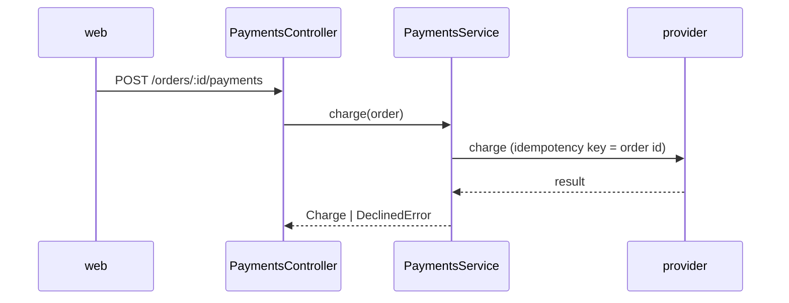

# api: payments

<!-- Template: copy to docs/codebases/<repo>/architecture/<area>.md only when an area outgrows the
     repository map (about 80 lines of its own, its own invariants, or three or more ADRs). `paths`
     lists the code this document covers, as hub-relative globs; `pnpm check` fails if a glob stops
     matching any file, so the document cannot silently outlive its code. -->

Charges customers through the payment provider. Everything that moves money passes through `repos/api/src/payments/payments.service.ts::PaymentsService`.

## Components

| File | Role |
|---|---|
| `repos/api/src/payments/payments.controller.ts` | `POST /orders/:id/payments` and the saved-card variant |
| `repos/api/src/payments/payments.service.ts` | Charging, idempotency keys, decline mapping |
| `repos/api/src/payments/provider.client.ts` | Thin wrapper around the provider SDK; the only file that imports it |
| `repos/api/src/payments/webhooks.controller.ts` | Verifies and applies provider webhooks |

## Flow

## Invariants

- Idempotency key is the order ID (ADR-0012).
- Webhooks are trusted only after signature verification.

## Decisions

- [ADR-0012: Payment provider calls are idempotent per order](../../../adr/0012-idempotent-payment-calls.md)

## Links

- [api map](../ARCHITECTURE.md)
- [Checkout payments feature](../../../features/checkout-payments.md)
