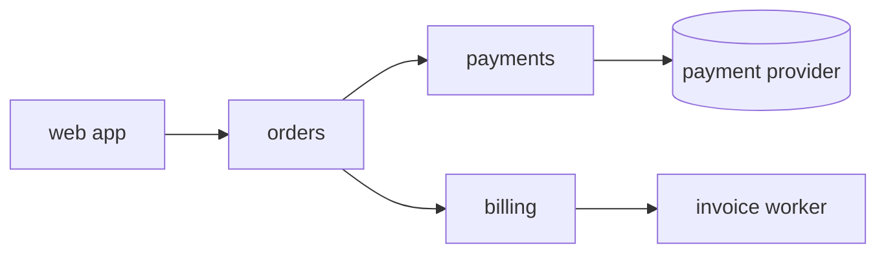

# api: architecture

<!-- Template: copy to docs/codebases/<repo>/ARCHITECTURE.md when onboarding a repository, link it from
     the "Product repositories" table in docs/ARCHITECTURE.md, and keep it under about 200 lines.
     Every structural file listed in hub.config.json "mustDocument" must be named here by
     backticked path or covered by an area document's `paths`. Cite code as `path::Symbol`: Graphify
     links only that form to the code (a bare path is checked but not linked). It skips diagrams, so
     name each box in the prose too. -->

The API serves the web app and partner integrations: catalogue, orders, payments and invoicing. NestJS 11 on Node 20, deployed by the infra repository as an SST `Service` behind an Application Load Balancer.

## Deployables

| What | Entry point | Deployed by |
|---|---|---|
| HTTP API | `repos/api/src/main.ts` | `repos/infra/infra/api.ts` |
| Invoice worker | `repos/api/src/worker.ts` | `repos/infra/infra/worker.ts` |

## Modules

| Module | Responsibility | Details |
|---|---|---|
| `repos/api/src/app.module.ts::AppModule` | Wires every module, global pipes and config | this page |
| `repos/api/src/catalogue/catalogue.module.ts::CatalogueModule` | Products, prices, stock | this page |
| `repos/api/src/orders/orders.module.ts::OrdersModule` | Order lifecycle from cart to fulfilment | this page |
| `repos/api/src/payments/payments.module.ts::PaymentsModule` | Charges through the payment provider | [payments area](architecture/payments.md) |
| `repos/api/src/billing/billing.module.ts::BillingModule` | Invoices and credit notes | [billing area](architecture/billing.md) |

## Cross-cutting concerns

- **Configuration:** `repos/api/src/config/config.schema.ts::ConfigSchema` validates environment variables at boot; SST `Resource` links supply secrets.
- **Errors:** domain errors extend `repos/api/src/common/errors.ts::DomainError` and map to HTTP status codes in one exception filter.
- **Auth:** every route requires a session unless decorated with `@Public()`.
- **Observability:** structured JSON logs; card numbers and tokens are redacted by the logger (CHECKOUT-PAY-4).

## Patterns

New code follows [Idempotent message handlers](../../patterns/idempotent-message-handlers.md) in every consumer, and [REST controllers](../../patterns/rest-controllers.md) in every HTTP module.

Known deviations, to bring in line when the code is next changed substantially:

- `repos/api/src/legacy-sync/` predates idempotent handlers: a redelivered message re-sends its email.

## Invariants

- Only the payments module talks to the payment provider.
- Invoices are never updated after issue; corrections are credit notes.

## Links

- [System architecture](../../ARCHITECTURE.md)
